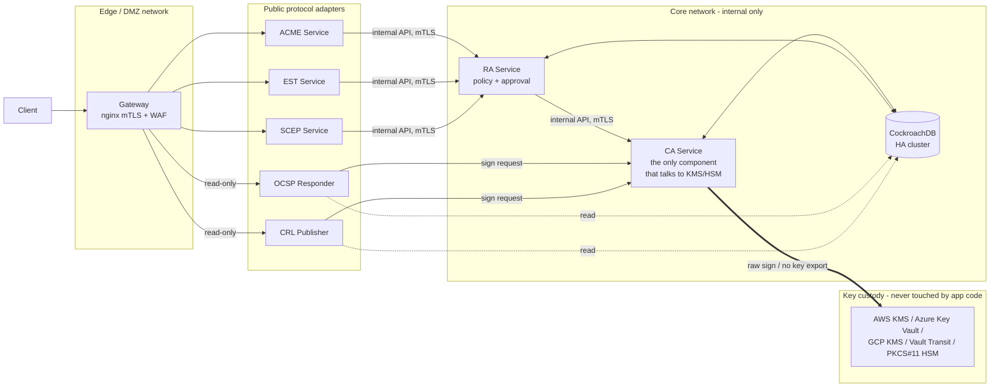

# PKICA — Enterprise PKI Management Platform

[](https://github.com/OWNER/REPO/actions/workflows/ci.yml)
[](https://github.com/OWNER/REPO/actions/workflows/cd.yml)
[](https://github.com/OWNER/REPO/actions/workflows/codeql.yml)

> Replace `OWNER/REPO` above with your actual GitHub org/repo once pushed —
> see [docs/CI_CD.md](docs/CI_CD.md) for what each pipeline does and how to
> configure signed, published container images.

A hardened, containerized, horizontally-scalable Public Key Infrastructure (PKI)
platform written in Python. Every functional role (CA, RA, OCSP, CRL, ACME, EST,
SCEP, Gateway) runs as an **independent, minimal-privilege container** that can
be deployed together on one host (via `docker-compose.yml`) or **split across
separate physical/virtual machines** for defense-in-depth and High Availability.

## Why this architecture

Real-world enterprise PKI security hinges on one principle: **the CA signing
key must be reachable by as few components as possible.**



* **CA service** is the *only* component that ever calls the KMS/HSM. It never
  exposes an endpoint on the edge network. Root and Intermediate CA keys never
  leave the KMS/HSM boundary — the CA only ever asks for a raw signature over
  a digest.
* **RA service** is the single choke point for policy enforcement (allowed
  profiles, requester identity, approval workflow) for *every* enrollment
  protocol (custom REST, ACME, EST, SCEP).
* **OCSP/CRL** are stateless from a key-custody perspective — they read
  revocation state from the database and ask the CA to sign the response/CRL.
* Every service can be scaled independently and placed on a separate host
  (see [docs/SPLIT_DEPLOYMENT.md](docs/SPLIT_DEPLOYMENT.md)).

## Components

| Service | Purpose | Network exposure |
|---|---|---|
| `ca` | Root/Intermediate CA lifecycle, issuance, revocation, KMS/HSM integration | internal only (`core` network) |
| `ra` | Enrollment policy engine, approval workflow, single entry point to `ca` | internal (`core` + `public`) |
| `ocsp` | RFC 6960 OCSP responder | edge (read path) |
| `crl` | CRL generation & distribution | edge (read path) |
| `acme` | RFC 8555 ACME server (automated cert issuance) | edge |
| `est` | RFC 7030 EST server (enterprise device enrollment) | edge |
| `scep` | SCEP server (legacy network device enrollment) | edge |
| `gateway` | nginx reverse proxy, TLS/mTLS termination, rate limiting | public |
| `cockroachdb` | Distributed SQL, multi-region HA, encryption at rest | internal only |

## Cloud / HSM Key Storage

Pluggable backend (`common/pkicore/kms`):

* AWS KMS (asymmetric CMKs, `RSASSA_PKCS1_V1_5` / `ECDSA_SHA_256+`)
* Azure Key Vault (Keys, HSM-backed SKUs supported)
* Google Cloud KMS
* HashiCorp Vault Transit engine
* PKCS#11 HSM (Thales Luna, Entrust nShield, SoftHSM2 for dev/test)
* `software` backend (AES-encrypted key file) — **development/testing only**,
  refuses to start unless `PKICA_ALLOW_SOFTWARE_KMS=true`.

Select per-CA in the `ca_backends` table / `CA_KEY_BACKEND` env var.

## Quick start (single host, all components)

```bash
cp .env.example .env
# edit .env: set strong secrets, choose KMS backend, etc.
python scripts/generate-dev-certs.py   # dev-only internal mTLS material
docker compose up -d --build
docker compose exec ca python -m app.bootstrap create-root --name root-ca --subject '{"cn":"PKICA Root CA","o":"ACME Corp"}'
docker compose exec ca python -m app.bootstrap create-intermediate --name issuing-ca-1 --parent root-ca --subject '{"cn":"PKICA Issuing CA 1","o":"ACME Corp"}'
docker compose exec ca python scripts/seed-profiles.py --issuing-ca issuing-ca-1
```

See [docs/DEPLOYMENT.md](docs/DEPLOYMENT.md) for full bootstrap, HA, and
production hardening steps, and [docs/SPLIT_DEPLOYMENT.md](docs/SPLIT_DEPLOYMENT.md)
for running each service on its own machine.

## Security hardening highlights

See [docs/THREAT_MODEL.md](docs/THREAT_MODEL.md) for the full model. Summary:

* Distroless/minimal runtime images, multi-stage builds, no shell in
  production images, non-root UID, read-only root filesystem, all Linux
  capabilities dropped, `no-new-privileges`, seccomp profile.
* Private keys never touch application memory as exportable material —
  KMS/HSM raw-sign only.
* mTLS between every internal service; short-lived service certs issued by
  the platform's own "infra" intermediate CA (bootstrap chicken-and-egg
  solved via a one-time init token, see docs).
* OIDC/SSO (RBAC) for human operators, mTLS + scoped API tokens for machines.
* Full audit log (tamper-evident hash chain) for every issuance/revocation/
  approval event, shipped to external SIEM.
* Secrets never baked into images — read from Docker secrets / files / env,
  never from build args or source.
* CockroachDB with encryption-at-rest, TLS between nodes, automatic
  multi-node HA and rolling upgrades.

## Repository layout

```
common/pkicore/     shared library: crypto, KMS backends, DB models, auth, audit
services/ca/        Certificate Authority service
services/ra/        Registration Authority service
services/ocsp/      OCSP responder
services/crl/       CRL publisher
services/acme/      ACME protocol adapter
services/est/       EST protocol adapter
services/scep/      SCEP protocol adapter
services/gateway/   nginx reverse proxy / mTLS termination
docs/               architecture, threat model, deployment guides
security/           seccomp profiles, hardening checklists
scripts/            bootstrap & operational scripts
```
