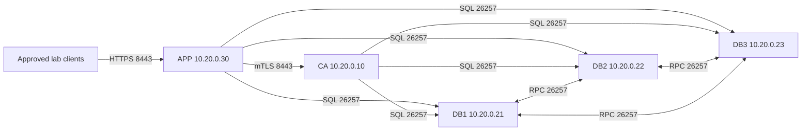

# Debian 13 quickstart: database nodes on separate hosts

Use this option to run **one CockroachDB node on each of three independent
Debian 13 hosts**, alongside the CA and APP hosts. It replaces the single DB
host in the [multi-host quickstart](QUICKSTART_MULTI_HOST.md). CA, RA, and ACME
receive all three SQL addresses so a new connection can use another reachable
node. No SQL load balancer is required for this example.

This remains an **isolated evaluation deployment** with insecure SQL/node
traffic, software CA keys, and the development administrator identity. The
[application limitations and production requirements](QUICKSTART_LIMITATIONS.md)
still apply. A replicated database does not make the single CA or APP host
highly available.

These instructions create a **new cluster**. They do not migrate an existing
installation: changing application URLs to an empty cluster does not copy its
CA records, certificates, or audit history. Preserve existing volumes and plan
a tested backup/restore or node migration separately if data already exists.

## 1. Plan the five-host layout

| Host | Private IP | Services | Starting lab capacity |
|---|---|---|---|
| CA | `10.20.0.10` | `ca`, `ca-mtls-proxy` | 2 vCPU, 4 GiB RAM, 30 GiB free SSD |
| DB1 | `10.20.0.21` | One `roach` node, locality `region=lab,zone=db1` | 2 vCPU, 4 GiB RAM, 30 GiB free SSD |
| DB2 | `10.20.0.22` | One `roach` node, locality `region=lab,zone=db2` | 2 vCPU, 4 GiB RAM, 30 GiB free SSD |
| DB3 | `10.20.0.23` | One `roach` node, locality `region=lab,zone=db3` | 2 vCPU, 4 GiB RAM, 30 GiB free SSD |
| APP | `10.20.0.30` | Gateway, RA, ACME, EST, SCEP, OCSP, CRL | 4 vCPU, 8 GiB RAM, 40 GiB free SSD |

These are lab estimates, not production sizing. Each node stores a replicated
copy of data; adding three disks does not give three times the usable logical
database capacity. Keep clocks synchronized and use reliable, low-latency private
links. The locality labels describe this example; assign labels that match your
actual failure domains. Three VMs on the same physical server do not protect
against losing that server.



## 2. Prepare every host and open the required paths

Complete [Prepare Debian 13](QUICKSTART.md#2-prepare-debian-13) on **all five
hosts**, including Docker, the tools, and the same repository commit at
`/opt/PKICA`. Use root Bash shells for the commands below. The node manifest
uses the same CockroachDB `v24.1.5` image as the other quickstarts.

Apply the [distributed-database firewall rules](FIREWALL_RULES.md#42-five-hosts-with-one-database-node-per-host)
before starting containers:

| Source | Destination | TCP destination port | Purpose |
|---|---|---|---|
| Each DB node | Both other DB nodes | 26257 | Cluster join, replication, and node RPC; both directions |
| CA and APP | **Each** of DB1, DB2, DB3 | 26257 | SQL and connection failover |
| APP | CA | 8443 | CA mTLS proxy |
| Approved client networks | APP | 8443 | Gateway HTTPS |
| Administrative workstation/bastion | All five hosts | 22, if SSH is used | Administration |

Keep the installation DNS, time, APT, and registry egress rules on each new
host. SQL and node RPC share TCP 26257 in this manifest. The DB console on 8080
is not published. Apply restrictions to Docker forwarding as well as the host
firewall, and account for the actual source addresses after NAT.

## 3. Prepare CA and APP, including the SQL host list

Complete [multi-host section 3](QUICKSTART_MULTI_HOST.md#3-prepare-the-ca-configuration-and-transfer-package)
to generate the CA/APP lab TLS material and install their separate `.env` files.
Do **not** start the old DB-host Compose file from that guide's section 4.

Then run this block on **both CA and APP** from `/opt/PKICA`. It updates only
the database settings in the already-created `.env`, preserving the audit and
key secrets. Replace the example IPs if necessary. The URL must stay on one line.

```bash
cd /opt/PKICA
python3 - <<'PY'
from pathlib import Path

path = Path(".env")
lines = path.read_text().splitlines()
lines = [line for line in lines if not line.startswith(("DB_HOST_IP=", "DB_SQL_URL="))]
lines.append("DB_SQL_URL=cockroachdb+psycopg://root@/pkica?host=10.20.0.21:26257&host=10.20.0.22:26257&host=10.20.0.23:26257&sslmode=disable&connect_timeout=5")
path.write_text("\n".join(lines) + "\n")
path.chmod(0o600)
PY
```

The CA and APP manifests use `DB_SQL_URL` when it is set; otherwise they retain
the original `DB_HOST_IP` single-endpoint configuration. This change affects CA,
RA, and ACME, the actual SQL clients. The full URL uses the installed
CockroachDB SQLAlchemy dialect and Psycopg 3's multiple-host connection support.
See the [dialect's Psycopg guide](https://github.com/cockroachdb/sqlalchemy-cockroachdb/blob/v2.0.4/README.psycopg.md)
and [SQLAlchemy multiple-host connection syntax](https://docs.sqlalchemy.org/en/20/dialects/postgresql.html#specifying-multiple-fallback-hosts).

Hosts are attempted in order for **new connections**; the timeout applies per
host. This is connection failover, not round-robin load balancing. Connections
and transactions can fail during a node loss; even a new transaction can receive
a serialization error (`40001`) while leases move. PKICA enables pool pre-ping
but does not implement transaction replay; review an issuance result before
repeating a failed write. See [SQLAlchemy disconnect handling](https://docs.sqlalchemy.org/en/20/core/pooling.html#disconnect-handling-pessimistic).

## 4. Configure one database node per host

Use [compose.db-node.yml](examples/quickstart/compose.db-node.yml) separately on
DB1, DB2, and DB3. Select the host-specific values in that host's root shell:

On **DB1**:

```bash
DB_NODE_IP=10.20.0.21
DB_LOCALITY=region=lab,zone=db1
```

On **DB2**:

```bash
DB_NODE_IP=10.20.0.22
DB_LOCALITY=region=lab,zone=db2
```

On **DB3**:

```bash
DB_NODE_IP=10.20.0.23
DB_LOCALITY=region=lab,zone=db3
```

Then run the following on **each DB host**, keeping its selected values:

```bash
cd /opt/PKICA
if [ -e .env ]; then
  echo '.env already exists; preserve and review its node settings.'
else
  (
    umask 077
    cat > .env <<EOF
DB_NODE_IP=${DB_NODE_IP:?select the private IP for this host first}
DB_LOCALITY=${DB_LOCALITY:?select the locality for this host first}
DB_JOIN_ADDRESSES=10.20.0.21:26257,10.20.0.22:26257,10.20.0.23:26257
EOF
  )
fi
dcnode() {
  docker compose --env-file .env -p pkica-db-node \
    -f docs/examples/quickstart/compose.db-node.yml "$@"
}
dcnode config --quiet
dcnode pull
dcnode up -d roach
dcnode ps -a
```

The command listens inside each container on TCP 26257 and advertises that
node's **host private IP and published port**. All three nodes share the same
join list. Local Docker names such as `roach` cannot identify peers on other
machines. The host IP must already exist on its interface and must be reachable
from the other containers. CockroachDB documents these addresses in
[`cockroach start`](https://www.cockroachlabs.com/docs/v24.1/cockroach-start).

Each host's Docker daemon creates its own `pkica-db-node_roach-data` volume.
Despite the identical volume name, these are independent node stores on
different hosts. Never mount one shared directory/volume into multiple nodes or
copy a live node store to create another node. Do not run this manifest three
times against the same host and store.

Before initialization, health checks can fail because SQL is not yet available.
Start **all three nodes** before proceeding. From each DB host, verify the private
published ports are reachable:

```bash
for peer in 10.20.0.21 10.20.0.22 10.20.0.23; do
  nc -vz -w 5 "$peer" 26257
done
```

A host TCP check does not establish container connectivity; the cluster status
and SQL checks below verify the cluster after initialization.

## 5. Initialize this cluster exactly once

On **DB1 only**, initialize the new cluster through its local node:

```bash
cd /opt/PKICA
dcnode exec -T roach ./cockroach init --insecure --host=localhost:26257
for attempt in $(seq 1 60); do
  dcnode exec -T roach ./cockroach sql --insecure --host=localhost:26257 \
    --execute='SELECT 1;' && break
  sleep 2
done
dcnode exec -T roach ./cockroach sql --insecure --host=localhost:26257 \
  --execute='CREATE DATABASE IF NOT EXISTS pkica;'
dcnode exec -T roach ./cockroach sql --insecure --host=localhost:26257 --database=pkica \
  --execute='CREATE SEQUENCE IF NOT EXISTS audit_log_seq;'
dcnode exec -T roach ./cockroach node status --insecure --host=localhost:26257 --ranges
```

Run `init` **once for the whole cluster**, not once per node. Joining nodes use
the existing cluster; they do not need separate initialization. Preserve the
volumes if a retry reports that the cluster is already initialized. See
[`cockroach init`](https://www.cockroachlabs.com/docs/v24.1/cockroach-init).

Proceed only after SQL succeeds and status shows three distinct node IDs,
their `.21`, `.22`, and `.23` advertised addresses, and live/available nodes.
Node IDs are assigned by the cluster; do not assume DB1 must have ID 1. Repeat
the status command from DB2 and DB3 to confirm they see the same three members.
The audit sequence is required before the application's schema bootstrap.

## 6. Bootstrap CA and start APP

On **CA and APP**, first confirm they can reach every SQL endpoint:

```bash
for peer in 10.20.0.21 10.20.0.22 10.20.0.23; do
  nc -vz -w 5 "$peer" 26257
done
```

Now complete [multi-host section 5](QUICKSTART_MULTI_HOST.md#5-build-and-bootstrap-ca)
on CA, then [section 6](QUICKSTART_MULTI_HOST.md#6-build-and-start-app) on APP.
Those commands use the `DB_SQL_URL` configured above, build the appropriate
database-client images, and create the application schema/CAs/profiles once.
Do not repeat root/intermediate creation on an existing database.

Complete the gateway and mTLS checks in
[multi-host section 7](QUICKSTART_MULTI_HOST.md#7-verify-the-complete-path).
The development gateway address, trust files, and CA proxy address are unchanged.

## 7. Verify replication and connection failover

After application bootstrap, on **DB1**, inspect node status and PKICA's ranges:

```bash
dcnode exec -T roach ./cockroach node status --insecure --host=localhost:26257 --ranges
dcnode exec -T roach ./cockroach sql --insecure --host=localhost:26257 --database=pkica \
  --execute='SHOW RANGES FROM DATABASE pkica WITH DETAILS;'
```

Before testing a failure, wait for all three nodes to be live/available and each
PKICA range's `voting_replicas` to contain three distinct node IDs matching those
hosts. Inspect `lease_holder` as well. Do not stop a node while ranges are
unavailable or PKICA data is still replicating. The fields are documented in
[`SHOW RANGES`](https://www.cockroachlabs.com/docs/v24.1/show-ranges).

For ranges with three voting replicas, a majority of two can continue after one
node is lost. Loss of two nodes removes that majority. This depends on healthy
replication and connectivity; CA/APP failures remain separate. Some internal
ranges have higher configured replication targets, so do not equate all global
under-replication counters with PKICA's three-voter check. See CockroachDB's
[deployment and replication guidance](https://www.cockroachlabs.com/docs/v24.1/deploy-cockroachdb-on-premises).

Verify a **fresh database connection from each application host**. In the CA
shell, where the main guide defines `dcca`, define:

```bash
dcsql() { dcca exec -T ca python3 - "$@"; }
```

In the APP shell, where the main guide defines `dcapp`, define:

```bash
dcsql() { dcapp exec -T ra python3 - "$@"; }
```

Run this same read-only check on **both** hosts:

```bash
dcsql <<'PY'
from sqlalchemy import text
from pkicore.config import get_settings
from pkicore.db.session import build_engine

engine = build_engine(get_settings())
with engine.connect() as connection:
    count = connection.execute(text("SELECT count(*) FROM certificate_authorities")).scalar_one()
    host = connection.connection.driver_connection.info.host
    print("Connected SQL host:", host, "CA records:", count)
    assert count >= 2, "Complete CA bootstrap first"
engine.dispose()
PY
```

For a planned **lab-only** failure test:

1. Confirm the three-node and voting-replica checks above have passed.
2. On DB1 run `dcnode stop -t 60 roach`. Leave DB2 and DB3 running.
3. Repeat the read-only `dcsql` block on CA and APP. A new connection should
   select `.22` or `.23` and read the CA records. Initial attempts may wait for
   the configured connection timeout or lease movement; inspect errors and
   retry this read-only check after the surviving nodes settle.
4. Repeat APP's `/api/v1/requests` check from the main guide. An interrupted
   existing request can fail; the test does not promise transparent recovery of
   in-flight operations or permission to replay issuance writes.
5. On DB1 run `dcnode up -d roach` with the **same volume and configuration**.
   Wait for three live/available nodes and three voters per PKICA range again
   before any further maintenance or failure test.

No `init`, CA creation, or volume deletion is part of this recovery. Recreating a
Python process for the read check proves new-connection failover without relying
on an old connection pool.

## 8. Restart, extend, and recover the cluster

Keep each node's `.env`, private address, locality, Compose project name, and
data volume together. Recreate the `dcnode` shell function after logging in again.
For a routine node restart, use `dcnode stop -t 60 roach` followed by
`dcnode up -d roach`. Maintain a healthy majority; restart at most one of these
three nodes at a time and wait for it to recover before moving to another.
After a full shutdown, start the existing DB nodes first, verify the cluster,
then start CA and APP. Do not run `init` again.

To add a **fourth, fresh node** on another host, prepare Debian/Docker there,
apply the peer/client firewall rules, give it its own `DB_NODE_IP` and locality,
and point `DB_JOIN_ADDRESSES` at the existing cluster. Start the same node manifest
with an empty, independent node store; skip initialization. Check its membership
from an existing node. Add its SQL address to CA/APP's `DB_SQL_URL` if it should
also accept their client connections, then recreate the affected services with
`dcca up -d ca` and `dcapp up -d ra acme` to apply the environment change.
Adding a fourth node does not make three-voter ranges tolerate two node failures.

For planned permanent removal, use CockroachDB's
[decommissioning procedure](https://www.cockroachlabs.com/docs/v24.1/node-shutdown)
and the actual node IDs, allowing replica movement before removing its store or
address. Do not treat `docker compose down -v` as node decommissioning. Replacement
of a permanently lost node is different from restarting its intact store.

Database replication is not a backup. Retain a consistent database backup
including the audit sequence, and coordinate it with CA keys, the software master
key, audit secret, APP state, certificates, and configuration as described in
[multi-host recovery](QUICKSTART_MULTI_HOST.md#8-restart-and-recovery). Before
production, enable CockroachDB node/client TLS with SANs for all advertised and
SQL names, use scoped users, and test recovery and application transaction-error
handling. Distributing the database does not resolve the other documented
production requirements.
