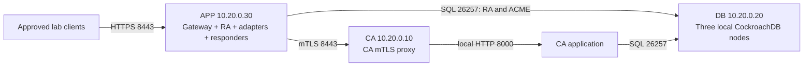

# Debian 13 quickstart: multiple hosts

This guide deploys PKICA across three Debian 13 servers with separate CA,
database, and application roles. First complete
[Prepare Debian 13](QUICKSTART.md#2-prepare-debian-13) on **each** server, including
the repository checkout at `/opt/PKICA`. Use the same Git commit everywhere.

Choose the database placement before starting:

| Option | Hosts | Instructions |
|---|---|---|
| All database nodes on one host | CA + DB + APP (three hosts) | Continue on this page |
| One database node per host | CA + DB1 + DB2 + DB3 + APP (five hosts) | Follow the [distributed database quickstart](QUICKSTART_DATABASE_CLUSTER.md), which reuses this page's CA/APP steps |

The distributed option supplies a per-node Compose file, a shared cluster join
list, client connection failover, and a single-node failure test. It does not
require putting all database containers on the same server.

This is an **isolated evaluation deployment**, using the software key backend,
development administrator identity, development TLS material, and an insecure
database. Restrict all three hosts to your lab/private network. It does not
provide host-level HA or a production-ready PKI. Read the
[current application limitations and production requirements](QUICKSTART_LIMITATIONS.md)
before proceeding; a successful installation does not resolve those defects.

## 1. Assign hosts and addresses

Replace these addresses consistently in `.env`, administrative commands, DNS,
and firewall policy. Addresses must already be assigned to the hosts' private
interfaces; Compose does not configure host interfaces or a VPN.

| Role | Example private address | Services | Starting lab capacity |
|---|---|---|---|
| CA | `10.20.0.10` | `ca`, `ca-mtls-proxy` | 2 vCPU, 4 GiB RAM, 30 GiB free SSD |
| DB | `10.20.0.20` | `roach1`, `roach2`, `roach3`, one-off `roach-init` | 4 vCPU, 8 GiB RAM, 50 GiB free SSD |
| APP | `10.20.0.30` | `gateway`, `ra`, `ocsp`, `crl`, `acme`, `est`, `scep` | 4 vCPU, 8 GiB RAM, 40 GiB free SSD |

Capacity figures are estimates for an evaluation, including some build space.
All three database containers live on DB in this example. Losing DB loses access
to the whole cluster. CA and APP are also single points of failure.



The APP services keep their local Docker DNS names, so the gateway can use the
repository's existing upstream names. Docker bridge networks do not span hosts.
The manifests explicitly use the DB host address for SQL and map the CA proxy's
name to the CA host with `extra_hosts`. This preserves the development
certificate's `ca-mtls-proxy` SAN. Changing the CA URL directly to an IP without
a matching certificate IP SAN would fail TLS verification.

## 2. Apply network prerequisites

Apply the complete [firewall rules](FIREWALL_RULES.md) before starting services.
For this topology the only published service ports are:

| Source | Destination | TCP destination port | Purpose |
|---|---|---|---|
| Approved administrator/client networks | APP `10.20.0.30` | 8443 | Gateway HTTPS; restrict especially because development identity is enabled |
| APP `10.20.0.30` | CA `10.20.0.10` | 8443 | RA and responder calls through the CA mTLS proxy |
| CA `10.20.0.10`, APP `10.20.0.30` | DB `10.20.0.20` | 26257 | CA, RA, and ACME SQL access |
| Administrative workstation/bastion | All three hosts | 22, if SSH is used | Administration and certificate/configuration transfer |

Allow installation downloads and DNS/time synchronization as specified in the
firewall guide. Do not expose SQL publicly: the example uses `--insecure`, so
network access grants unauthenticated database access. Keep these links on an
isolated lab VLAN or an already established encrypted private tunnel. This guide
does not install or configure a VPN.

Filtering must cover Docker's forwarded traffic, not just host INPUT rules.
Source restrictions must be enforced by an upstream ACL or Docker-aware host
policy. Match the actual source address observed after any NAT. No raw application
port 8000, database console 8080, or Docker daemon port needs to be published.

## 3. Prepare the CA configuration and transfer package

On **CA**, as root, run from `/opt/PKICA`. Use a fresh checkout without `.env` or
`certs/infra-ca.crt`; if either already exists, preserve it and adapt the existing
configuration instead of rerunning first-install generation.

```bash
cd /opt/PKICA
test ! -e .env && test ! -e certs/infra-ca.crt
```

Proceed with the following block only if that check succeeds:

```bash
(
  umask 077
  PKICA_AUDIT_SECRET="$(openssl rand -base64 32)"
  cat > .env <<EOF
CA_HOST_IP=10.20.0.10
DB_HOST_IP=10.20.0.20
PKICA_ENVIRONMENT=development
AUDIT_HASH_CHAIN_SECRET=$PKICA_AUDIT_SECRET
SOFTWARE_KMS_MASTER_KEY=$(openssl rand -base64 32)
EOF
  python3 scripts/generate-dev-certs.py

  # Replace admin with the existing authorized SSH account on CA.
  PKICA_ADMIN=admin
  install -d -o "$PKICA_ADMIN" -m 0700 /var/tmp/pkica-app-tls
  cat > /var/tmp/pkica-app-tls/app.env <<EOF
CA_HOST_IP=10.20.0.10
DB_HOST_IP=10.20.0.20
APP_HOST_IP=10.20.0.30
PKICA_ENVIRONMENT=development
AUDIT_HASH_CHAIN_SECRET=$PKICA_AUDIT_SECRET
EST_ENROLLMENT_USERS=device1:$(openssl rand -hex 24)
EOF
  chown "$PKICA_ADMIN" /var/tmp/pkica-app-tls/app.env
  chmod 0600 /var/tmp/pkica-app-tls/app.env
  for filename in infra-ca.crt client-ca-bundle.crt gateway.crt gateway.key \
    ra.crt ra.key ocsp.crt ocsp.key crl.crt crl.key; do
    install -o "$PKICA_ADMIN" -m 0600 "certs/$filename" "/var/tmp/pkica-app-tls/$filename"
  done
)
chmod 0755 certs
chmod 0644 certs/*.crt
chmod 0600 certs/*.key
```

The transfer package contains only APP's identities, public trust certificates,
and APP configuration. It does **not** include the infrastructure CA private key,
CA proxy private key, or software KMS master key. The shared audit secret must
match on CA and APP.

On the **administrative workstation**, use the existing SSH account on each host
to transfer this restricted package. These commands assume a Unix/Bash workstation
with `scp`; an equivalent managed secure file-transfer tool is also suitable.

```bash
PKICA_TRANSFER_DIR="$(mktemp -d)"
chmod 0700 "$PKICA_TRANSFER_DIR"
scp -r admin@10.20.0.10:/var/tmp/pkica-app-tls "$PKICA_TRANSFER_DIR/"
scp -r "$PKICA_TRANSFER_DIR/pkica-app-tls" admin@10.20.0.30:~/
```

The administrator workstation initiates both SSH connections; no CA-to-APP SSH
firewall opening is required. Keep the package private and remove the temporary
copies on CA, APP, and the workstation after installation is verified and your
encrypted recovery copy is secured.

On **APP**, as root, install the transferred files. Replace `/home/admin` if the
SSH account has a different home directory. Preserve any existing `.env`/TLS
configuration instead of overwriting it on a repeat installation.

```bash
cd /opt/PKICA
install -m 0600 /home/admin/pkica-app-tls/app.env .env
install -d -m 0755 certs
for filename in infra-ca.crt client-ca-bundle.crt gateway.crt ra.crt ocsp.crt crl.crt; do
  install -m 0644 "/home/admin/pkica-app-tls/$filename" "certs/$filename"
done
for filename in gateway.key ra.key ocsp.key crl.key; do
  install -m 0600 "/home/admin/pkica-app-tls/$filename" "certs/$filename"
done
```

For a real deployment, provision separate service certificates from your managed
infrastructure PKI instead of distributing generated lab identities. Keep the
authorized CA client CNs `ra`, `ocsp`, and `crl`; use matching server SANs and a
consistent trust bundle. The infrastructure TLS CA is distinct from `root-ca`
and `issuing-ca-1` created later for the application.

## 4. Start and initialize DB

This section is for the **three-host** layout. For separate DB hosts, use
[distributed database sections 4 and 5](QUICKSTART_DATABASE_CLUSTER.md#4-configure-one-database-node-per-host)
instead. Configure `DB_SQL_URL` on CA and APP as described there before returning
to sections 5 and 6 below.

On **DB**, as root:

```bash
cd /opt/PKICA
if [ ! -e .env ]; then
  (umask 077; printf '%s\n' 'DB_HOST_IP=10.20.0.20' > .env)
fi
dcdb() {
  docker compose --env-file .env -p pkica-db \
    -f docs/examples/quickstart/compose.db.yml "$@"
}
dcdb config --quiet
dcdb pull
dcdb up -d roach1 roach2 roach3
dcdb run --rm --no-deps roach-init
for attempt in $(seq 1 60); do
  dcdb exec -T roach1 ./cockroach sql --insecure --host=roach1 \
    --execute='SELECT 1;' && break
  sleep 2
done
dcdb exec -T roach1 ./cockroach sql --insecure --host=roach1 \
  --execute='CREATE DATABASE IF NOT EXISTS pkica;'
dcdb exec -T roach1 ./cockroach sql --insecure --host=roach1 --database=pkica \
  --execute='CREATE SEQUENCE IF NOT EXISTS audit_log_seq;'
dcdb ps -a
```

Continue only after SQL succeeds. Cluster initialization is one-time; an
already-initialized message is not a reason to delete volumes. Only `roach1`'s
SQL/RPC port is bound to DB's private host IP. Node-to-node communication stays
on DB's local bridge. There is no database load balancer or automatic client
failover in this baseline.

The explicit sequence creation is required by the audit model. The CockroachDB
SQLAlchemy dialect does not create `audit_log_seq` automatically with the tables.

## 5. Build and bootstrap CA

On **CA**, as root:

```bash
cd /opt/PKICA
dcca() {
  docker compose --env-file .env -p pkica-ca \
    -f docs/examples/quickstart/compose.ca.yml "$@"
}
dcca config --quiet
dcca build
PROXY_UID="$(dcca run --rm --no-deps --entrypoint id ca-mtls-proxy -u)"
chown "$PROXY_UID" certs/ca-mtls-proxy.key
chmod 0600 certs/ca-mtls-proxy.key
dcca run --rm --no-deps ca-mtls-proxy nginx -t

dcca run --rm --no-deps --entrypoint python3 ca -m app.bootstrap create-root \
  --name root-ca --subject '{"cn":"PKICA Root CA","o":"Example Lab"}'
dcca run --rm --no-deps --entrypoint python3 ca -m app.bootstrap create-intermediate \
  --name issuing-ca-1 --parent root-ca \
  --subject '{"cn":"PKICA Issuing CA 1","o":"Example Lab"}'
dcca run --rm --no-deps --entrypoint python3 ca scripts/seed-profiles.py \
  --issuing-ca issuing-ca-1
dcca up -d ca ca-mtls-proxy
dcca ps -a
dcca logs --tail=100 ca ca-mtls-proxy
```

The successful bootstrap commands verify SQL access from a CA container, create
the initial schema, and store encrypted software keys on CA. They must complete
before APP starts. Root/intermediate creation is not idempotent. On an existing
installation, skip CA creation and preserve its key volume and master key.

Unlike the root reference Compose network layout, this CA example has an explicit
outbound bridge for database access across hosts. The CA application itself
still publishes no port; only its mTLS proxy is bound to `10.20.0.10:8443`.

## 6. Build and start APP

On **APP**, as root:

```bash
cd /opt/PKICA
dcapp() {
  docker compose --env-file .env -p pkica-app \
    -f docs/examples/quickstart/compose.app.yml "$@"
}
dcapp config --quiet
dcapp build
GATEWAY_UID="$(dcapp run --rm --no-deps --entrypoint id gateway -u)"
chown "$GATEWAY_UID" certs/gateway.key
chown 65532 certs/ra.key certs/ocsp.key certs/crl.key
chmod 0600 certs/*.key
dcapp run --rm --no-deps gateway nginx -t
nc -vz -w 5 10.20.0.10 8443
dcapp up -d
dcapp ps -a
dcapp logs --tail=100 ra gateway
```

Keep all commands tied to their role's Compose file. These manifests are
standalone: do not combine them with the root `docker-compose.yml`, which would
create extra local services and networks. Recreate `dcdb`, `dcca`, or `dcapp` in
a new Bash session before using it, and work from `/opt/PKICA`.

CA, RA, and ACME build with the quickstart
[database-client Dockerfile](examples/quickstart/Dockerfile.database-client),
which includes the CockroachDB SQLAlchemy dialect. The manifests pair that
dependency with `cockroachdb+psycopg://` database URLs. Reusing a stock service
image without this package, or switching back to `postgresql+psycopg://`, prevents
application database initialization.

APP's manifest includes the same RA/OCSP/CRL
[HTTPX client-certificate compatibility setting](QUICKSTART_LIMITATIONS.md#httpx-client-certificate-compatibility)
as the single-host quickstart. Review its trust-bundle requirements before adding
an external OIDC provider.

## 7. Verify the complete path

On **APP**, verify HTTPS using the generated gateway SAN with `--resolve`:

```bash
curl --fail --retry 15 --retry-delay 2 --retry-connrefused \
  --resolve gateway:8443:10.20.0.30 --cacert certs/infra-ca.crt \
  https://gateway:8443/healthz
curl --fail --resolve gateway:8443:10.20.0.30 --cacert certs/infra-ca.crt \
  https://gateway:8443/api/v1/healthz
curl --fail --resolve gateway:8443:10.20.0.30 --cacert certs/infra-ca.crt \
  https://gateway:8443/api/v1/requests
curl --fail --resolve gateway:8443:10.20.0.30 --cacert certs/infra-ca.crt \
  https://gateway:8443/directory

dcapp exec -T ra python3 - <<'PY'
from pkicore.ca_client import CAClient
from pkicore.config import get_settings
result = CAClient(get_settings()).get_ca_certificate("issuing-ca-1")
assert "BEGIN CERTIFICATE" in result["certificate_pem"]
print("APP -> CA mTLS and CA -> DB lookup succeeded:", result["name"])
PY
```

Expect nginx `ok`, RA JSON status, a requests list, ACME metadata, and the mTLS
confirmation. The requests list tests APP-to-DB connectivity; the last command
tests the actual service identity and cross-host CA path. A TCP probe alone does
not test authentication. These checks do not validate certificate chains or
protocol enrollment; see [limitations](QUICKSTART_LIMITATIONS.md).

From an **approved client**, copy only `infra-ca.crt` and repeat the gateway curl
check. From a source **outside** each allowlist, verify that CA 8443, DB 26257, and
restricted APP 8443 are unreachable. CA/DB should not expose 8000 or 8080; APP
should not expose its backends' 8000. The firewall guide includes further checks.

To run the optional [REST workflow smoke check](QUICKSTART.md#8-exercise-the-rest-approval-workflow)
on APP, add `10.20.0.30 gateway` to APP's `/etc/hosts` or its private DNS and confirm
`getent hosts gateway` returns that address. Then run `export
PKICA_URL=https://gateway:8443` before following that section. Production clients
need your chosen service FQDN, a matching gateway certificate, and managed trust;
the generated name and `--resolve` are temporary lab conventions.

## 8. Restart and recovery

Retain `.env`, TLS material, and the Compose project names. On routine restart,
use each role's `stop`/`start` commands. Start DB first and confirm SQL readiness,
then CA, then APP. If recreating containers, start the database nodes explicitly
and skip `roach-init` on the existing cluster; do not recreate the CAs.

| Host | Persistent recovery material |
|---|---|
| DB | Consistent CockroachDB backup/state from its three data volumes |
| CA | `software-kms-data`, original software master key, audit secret, CA TLS material, secured infrastructure CA material |
| APP | `scep-ra-data`, APP TLS identities/trust bundle, audit secret and remaining configuration |
| All | Git commit, image versions, Compose files, address/firewall configuration |

Keep a coordinated encrypted recovery set and test restoration before relying
on this installation. Never remove volumes to correct an initialization or TLS
failure. Lost software master keys cannot be recovered from the encrypted key
files. Consult [single-host troubleshooting](QUICKSTART.md#10-troubleshooting)
for common startup problems; for multi-host failures also check private routes,
source NAT, container egress, and `extra_hosts` against the actual CA address.

## 9. Moving beyond this topology

Before production, complete the [production requirements](QUICKSTART_LIMITATIONS.md#production-requirements),
including fixing certificate/enrollment defects, configuring real authentication,
database TLS and least-privilege users, managed service certificates, and a tested
KMS/HSM integration. Selecting a backend in `.env` alone does not supply SDK
credentials, grant permissions, or establish network access.

For database host-failure tolerance, place database nodes on distinct servers,
using the [distributed database quickstart](QUICKSTART_DATABASE_CLUSTER.md).
It provides the node manifests, per-host advertised addresses, initialization,
client host list, firewall matrix, and failure checks. It is an alternative to
this page's three-local-node DB configuration. Production additionally requires
node/client TLS and tested transaction-error handling; follow CockroachDB's
[multi-node deployment procedure](https://www.cockroachlabs.com/docs/stable/deploy-cockroachdb-on-premises).

For a separate edge/DMZ host, move the gateway and chosen adapters only after
defining authenticated, encrypted links to RA/responders, assigning separate
reachable upstream ports or proxies, updating nginx upstream resolution, and
extending firewall rules. Copying a Docker service name to another host does not
make it reachable. See [split-deployment design notes](SPLIT_DEPLOYMENT.md).
