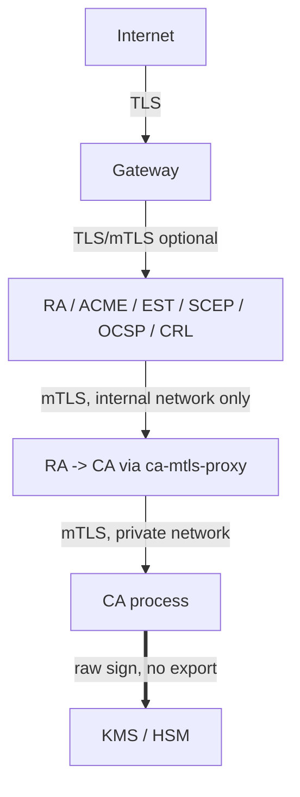

# Threat Model

## Assets

1. Root & Intermediate CA private keys (highest value — total PKI compromise).
2. The audit log (integrity — must be tamper-evident).
3. Issued certificates / revocation state (integrity & availability).
4. RA approval workflow (integrity — must not allow unauthorized issuance).
5. Human operator credentials (OIDC) and internal service mTLS credentials.

## Trust boundaries

* **Boundary 1 — Internet ↔ Gateway.** TLS 1.2+/1.3 only, strong ciphers,
  HSTS, rate limiting, connection limiting, request size limits.
* **Boundary 2 — Gateway ↔ internal services.** Plain HTTP is acceptable
  *only* on the isolated `public` docker network (no routes to the host or
  internet); OIDC bearer tokens / mTLS-derived headers still required for
  privileged operations.
* **Boundary 3 — RA/OCSP/CRL ↔ CA.** Mandatory mutual TLS via
  `ca-mtls-proxy`; the CA container has **no network path** to anything
  except that proxy (`ca-internal` network, `internal: true`, shared with
  no other container).
* **Boundary 4 — CA ↔ KMS/HSM.** Network/IAM-restricted to the CA service's
  identity only (IAM role / Key Vault access policy / Vault ACL / HSM
  partition password) — configure this outside of Docker (cloud IAM, HSM
  partition ACLs).

## Key threats & mitigations

| Threat | Mitigation |
|---|---|
| CA private key exfiltration | Key material never leaves the KMS/HSM boundary; `KMSBackend` has no `export` method; software backend is disabled by default and refuses to start without an explicit opt-in env var. |
| Malicious/compromised protocol adapter (ACME/EST/SCEP) issues arbitrary certs | Adapters only ever call the RA, never the CA; RA enforces per-profile policy (allowed protocols, key algorithms, SAN types, validity ceiling) independently of adapter-side checks; CA re-validates the same policy again (defense in depth). |
| Network-level container breakout reaching the CA | `ca` only joins `ca-internal` + `db` networks; the CA API additionally requires a verified mTLS client identity from an explicit allow-list per endpoint. |
| Audit log tampering (rogue DB admin) | SHA-256 HMAC hash chain over every entry (`pkicore/audit.py`); forwarded to an external SIEM in parallel so an attacker needs to compromise two independent systems. |
| Header spoofing of `X-Client-Cert-CN` | `ca-mtls-proxy`/gateway nginx configs explicitly strip any client-supplied value for that header before setting the verified one — a caller cannot inject its own identity. |
| Stolen human operator session | Short-lived OIDC access tokens (issuer-defined, recommend ≤15 min), RBAC scoping (`pkica-ra-approver` required for approvals), all actions audit-logged with the OIDC `sub`. |
| Container image supply-chain compromise | Multi-stage builds from pinned base image digests (pin in CI), distroless runtime with no shell/package manager, dependencies pinned in `requirements.txt`/`pyproject.toml`, recommend `docker scout`/`trivy` scanning in CI. |
| DoS via request floods | nginx `limit_req`/`limit_conn` at the gateway; horizontal scaling of every service independently. |
| Weak/legacy protocol downgrade (SCEP/EST) | SCEP/EST are opt-in and isolated to their own containers/profiles; disable the `scep`/`est` services entirely if not required by your device fleet. |

## Known scaffolding limitations (read before production use)

* CockroachDB in the default `docker-compose.yml` runs with `--insecure`
  for local bring-up simplicity. **Enable CockroachDB's native TLS
  (`--certs-dir`)** for any non-throwaway deployment — see
  [DEPLOYMENT.md](DEPLOYMENT.md).
* The dev mTLS material (`scripts/generate-dev-certs.py`) is for local
  testing only; production internal mTLS certs must come from your real
  infra CA with short lifetimes and automated rotation.
* SCEP's CMS (PKCS#7) implementation covers the common RSA/AES-128-CBC
  enrollment path; validate against your specific device/client population
  before relying on it operationally.
* ACME state (accounts/orders/authorizations/nonces) is stored in
  CockroachDB for HA, but the reference implementation only covers
  `http-01` challenges — add `dns-01`/`tls-alpn-01` if you need them.
